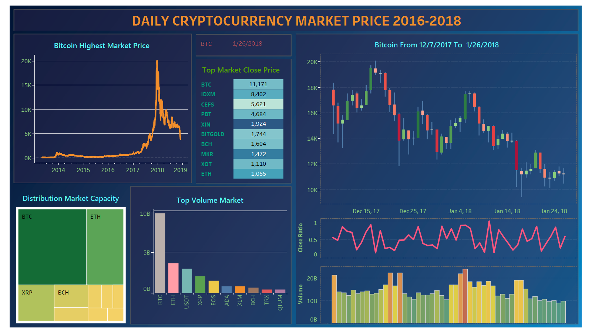

# Daily Cryptocurrency Prices Project

This project focuses on cryptocurrency prices from 2016 to 2018. It consists of two parts:

- Exploratory Data Analysis (EDA) and Visualization.
- Building a Dashboard using Tableau.

## Dataset

The dataset used in this project was obtained from [Kaggle](https://www.kaggle.com/datasets/jessevent/all-crypto-currencies?fbclid=IwAR1ClYMb9dVjpBwOPuqJfWkRf5gLsukrWscsuV_okKL4X6Q9e7JkjcGtdQ8). It provides comprehensive information on various cryptocurrencies and their daily prices. The dataset includes details such as currency symbol, date, open price, high price, low price, close price, volume, and market cap.

## Part 1: EDA and Visualization

In the first part of the project, exploratory data analysis was performed on the cryptocurrency dataset using Python and its libraries. Pandas was used to clean the data, while Matplotlib and Plotly libraries were employed for data visualization. Through data cleaning and visualization techniques, valuable insights were derived from the dataset, such as identifying trends, patterns, and outliers in cryptocurrency prices.

## Part 2: Building a Dashboard using Tableau

The second part of the project involved creating an interactive dashboard using Tableau. The cleaned dataset and the insights gained from the EDA were used to build a user-friendly and visually appealing dashboard. Tableau's powerful visualization capabilities were leveraged to create informative charts, graphs, and interactive features, allowing users to explore and analyze cryptocurrency prices effortlessly.
[See the dashboard here](https://public.tableau.com/app/profile/vo.hoang.thao.nguyen/viz/cryptocurrency_market/maindashboard?publish=yes)

### Part 3: Building an Automated Update Dashboard

incoming...
